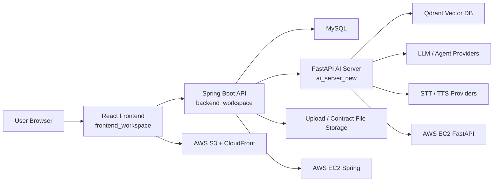

# Woorizip

Woorizip is a co-living housing platform that connects room discovery, AI-assisted consultation, tour requests, contract workflows, community posts, and facility reservations in one service flow. The project is organized as a multi-workspace application with a React frontend, Spring Boot backend, and FastAPI-based AI server.

## Architecture



## Tech Stack

| Area | Stack |
| --- | --- |
| Frontend | React 18, JavaScript, React Router, Axios, Reactstrap, TipTap |
| Backend | Java 21, Spring Boot 3.5, Spring Security, OAuth2 Client, JWT, JPA, QueryDSL, Gradle |
| AI Server | Python, FastAPI, LangGraph, Groq/OpenAI-compatible agent clients, STT/TTS, OCR/Vision modules |
| Database / Vector Store | MySQL, Qdrant |
| Deploy | GitHub Actions, AWS S3, CloudFront, EC2, SSM, RDS-compatible MySQL |

## Workspaces

```text
woorizip_project
|-- frontend_workspace   # React client
|-- backend_workspace    # Spring Boot API server
|-- ai_server_new        # FastAPI AI server
`-- .github              # CI/CD workflows and deployment scripts
```

## Key Features

- User signup, login, social login, ID/password recovery, JWT authentication
- Room and house search, registration, detail pages, wish list, and review-based discovery
- AI assistant that connects frontend chat, Spring Boot, and FastAPI
- AI tour request workflow that collects room, schedule, and user context through chat
- STT/TTS-based voice accessibility and page summary support
- Notice, information, event, Q&A, and AI-powered board summary features
- Facility and reservation management for co-living shared spaces
- Contract and payment-related workflow support
- Separate deployment pipelines for frontend, Spring Boot, and FastAPI

## Local Setup

### 1. Backend

Requirements:

- Java 21
- MySQL

```bash
cd backend_workspace
./gradlew bootRun
```

The backend uses environment variables for database, JWT, OAuth, payment, and AI integration settings. Check `backend_workspace/src/main/resources/application.properties` for the expected variable names.

Common variables:

```bash
DB_USERNAME=root
DB_PASSWORD=your_db_password
JWT_SECRET=your_jwt_secret
KAKAO_REST_API_KEY=your_kakao_key
KAKAOMAP_REST_API_KEY=your_kakaomap_key
GOOGLE_CLIENT_ID=your_google_client_id
GOOGLE_CLIENT_SECRET=your_google_client_secret
KAKAO_CLIENT_SECRET=your_kakao_client_secret
AI_AGENT_API_KEY=your_ai_agent_api_key
```

### 2. Frontend

Requirements:

- Node.js 20+
- npm

```bash
cd frontend_workspace
npm install
npm start
```

Optional environment variables:

```bash
REACT_APP_API_BASE_URL=http://localhost:8080
REACT_APP_AI_BASE_URL=http://localhost:8080
REACT_APP_KAKAO_MAP_KEY=your_kakao_map_key
REACT_APP_TOSS_CLIENT_KEY=your_toss_client_key
```

### 3. AI Server

Requirements:

- Python 3.11+
- pip

```bash
cd ai_server_new
python -m venv .venv
source .venv/bin/activate
pip install -r requirements.txt
uvicorn app.main:app --reload --host 0.0.0.0 --port 8000
```

On Windows PowerShell:

```powershell
cd ai_server_new
python -m venv .venv
.\.venv\Scripts\Activate.ps1
pip install -r requirements.txt
uvicorn app.main:app --reload --host 0.0.0.0 --port 8000
```

Common variables:

```bash
APP_API_KEY=local-dev-key
GROQ_API_KEY=your_groq_key
QDRANT_URL=your_qdrant_url
QDRANT_APIKEY=your_qdrant_api_key
SPRING_BASE_URL=http://localhost:8080
SPRING_INTERNAL_API_KEY=local-dev-key
GOOGLE_APPLICATION_CREDENTIALS=/path/to/service-account.json
```

Some AI vision modules require optional model files such as GroundingDINO weights. See comments in `ai_server_new/requirements.txt` for setup notes.

## Deployment

GitHub Actions deploy each workspace independently:

| Workflow | Target |
| --- | --- |
| `.github/workflows/frontend-deploy.yml` | React build to AWS S3 and CloudFront invalidation |
| `.github/workflows/spring-deploy.yml` | Spring Boot JAR upload and EC2 restart through AWS SSM |
| `.github/workflows/fastapi-deploy.yml` | FastAPI ZIP deployment to EC2 through AWS SSM |

Deployment secrets and production runtime values are managed through GitHub Actions secrets and AWS SSM Parameter Store.

## Branch Strategy

- `main`: production/default branch
- `develop`: integration branch
- `feature/*` and member branches: feature development and team collaboration

## Portfolio Focus

The portfolio highlights the following individual contribution areas:

- JWT authentication and login/session flow
- Spring Boot to FastAPI AI assistant orchestration
- AI tour request workflow with session and user context handling
- Voice accessibility with STT/TTS integration
- Deployment and GitHub-based collaboration workflow
